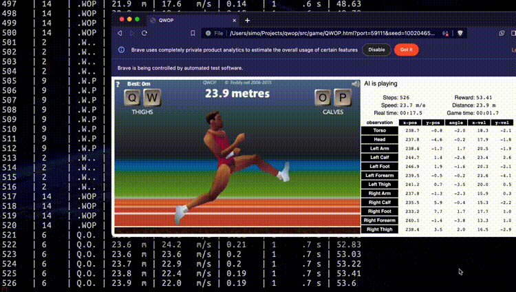
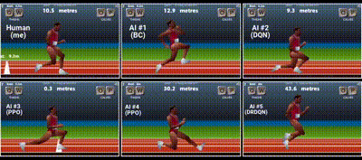

# QWOP Gym

A Gym environment for Bennet Foddy's game called _QWOP_.



[Give it a try](https://www.foddy.net/Athletics.html) and see why it's such a
good candidate for Reinforcement Learning :)

You should also check this [video](https://www.youtube.com/watch?v=2qNKjRwcx74) for a demo.

### Features

* A call to `.step()` advances exactly N game frames (configurable)
* Option to disable WebGL rendering for improved performance
* Is fully deterministic \*
* State extraction for a slim observation of 60 bytes
* Real-time visualization of various game stats (optional)
* Additional in-game controls for easier debugging

\* given the state includes the steps since last hard reset, see [♻️ Resetting](./doc/env.md#resetting)

## Getting started

1. Install [Python](https://www.python.org/downloads/) 3.10 or higher
1. Install a chrome-based web browser (Google Chrome, Brave, Chromium, etc.)
1. Download [chromedriver](https://googlechromelabs.github.io/chrome-for-testing/) 116.0 or higher
1. Install the `qwop-gym` package and patch QWOP.min.js from your terminal:

```bash
pip install qwop-gym

# Fetch & patch QWOP source code
curl -sL https://www.foddy.net/QWOP.min.js | qwop-gym patch
```

Create an instance in your code:

```python
import qwop_gym

env = gym.make("QWOP-v1", browser="/browser/path", driver="/driver/path")
```

## The `qwop-gym` tool

The `qwop-gym` executable is a handy command-line tool which makes it easy to
play, record and replay episodes, train agents and more.

Firstly, perform the initial setup:

```
qwop-gym bootstrap
```

Play the game (use Q, W, O, P keys):

```bash
qwop-gym play
```

Explore the other available commands:

```bash
$ qwop-gym -h
usage: qwop-gym [options] <action>

options:
  -h, --help  show this help message and exit
  -c FILE     config file, defaults to config/<action>.yml

action:
  play              play QWOP, optionally recording actions
  replay            replay recorded game actions
  train_bc          train using Behavioral Cloning (BC)
  train_gail        train using Generative Adversarial Imitation Learning (GAIL)
  train_airl        train using Adversarial Inverse Reinforcement Learning (AIRL)
  train_ppo         train using Proximal Policy Optimization (PPO)
  train_dqn         train using Deep Q Network (DQN)
  train_qrdqn       train using Quantile Regression DQN (QRDQN)
  spectate          watch a trained model play QWOP, optionally recording actions
  benchmark         evaluate the actions/s achievable with this env
  bootstrap         perform initial setup
  patch             apply patch to original QWOP.min.js code
  help              print this help message

examples:
  qwop-gym play
  qwop-gym -c config/record.yml play
```

For example, to train a PPO agent, edit [`config/ppo.yml`](./config/ppo.yml) and run:

```bash
python qwop-gym train_ppo
```

> [!WARNING]
> Although no rendering occurs during training, the browser window must remain
> open as the game is actually running at very high speeds behind the curtains.

Visualize tensorboard graphs:

```bash
tensorboard --logdir data/
```

Configure `model_file` in [`config/spectate.yml`](./config/spectate.yml) and watch your trained agent play the game:

```bash
python qwop-gym spectate
```

### Imitation

> [!NOTE]
> Imitation learning is powered by the
> [`imitation`](https://github.com/HumanCompatibleAI/imitation) library, which
> depends on the deprecated `gym` library which makes it incompatible with
> QwopEnv. This can be resolved as soon as `imitation` introduces support for
> `gymnasium`. As a workaround, you can checkout the `qwop-gym` project
> locally and use the `gym-compat` branch instead.

```bash
# In this branch, QwopEnv works with the deprecated `gym` library
git checkout gym-compat

# Note that python-3.10 is required, see notes in requirements.txt
pip install -r requirements.txt

# Patch the game again as this branch works with different paths
curl -sL https://www.foddy.net/QWOP.min.js | python -m src.game.patcher
```

For imitation learning, first record some of your own games:

```bash
python qwop-gym.py play -c config/record.yml 
```

Train an imitator via [Behavioral Cloning](https://imitation.readthedocs.io/en/latest/tutorials/1_train_bc.html):

```bash
python qwop-gym.py train_bc
```

### W&B sweeps

If you are a fan of [W&B](https://docs.wandb.ai/guides/sweeps), you can 
use the provided configs in `config/wandb/` and create your own sweeps.

`wandb` is a rather bulky dependency and is not installed by default. Install
it with `pip install wandb` before proceeding with the below examples.

```bash
# create a new W&B sweep
wandb sweep config/wandb/qrdqn.yml

# start a new W&B agent
wandb agent <username>/qwop/<sweep>
``` 

You can check out my W&B public QWOP project
[here](https://wandb.ai/s-manolloff/qwop-gym).
There you can find pre-trained model artifacts (zip files) of some
well-performing agents, as well as see how they compare to each other. This
[youtube video](https://www.youtube.com/watch?v=2qNKjRwcx74) showcases some of
them.



## Developer documentation

Info about the Gym env can be found [here](./doc/env.md)

Details about the QWOP game can be found [here](./doc/game.md)

## Similar projects

* https://github.com/Wesleyliao/QWOP-RL
* https://github.com/drakesvoboda/RL-QWOP
* https://github.com/juanto121/qwop-ai
* https://github.com/ShawnHymel/qwop-ai

In comparison, qwop-gym offers several key features:
* the env is _performant_ - perfect for on-policy algorithms as observations
can be collected at great speeds (more than 2000 observations/sec on an Apple
M2 CPU - orders of magnitute faster than the other QWOP RL envs).
* the env is _deterministic_ - there are no race conditions and randomness can
be removed if desired. Replaying recorded actions produces the same result.
* the env has a _simple reward model_ and compared to other QWOP envs, it is
less biased, eg. no special logic for stuff like _knee bending_,
_low torso height_, _vertical movement_, etc.
* the env allows all possible key combinations (15), other QWOP envs usually
allow only the "useful" 8 key combinations.
* great results (fast, human-like running) achieved by RL agents trained
entirely through self-play, without pre-recorded expert demonstrations
* qwop-gym already contains scripts for training with 6 different algorithms
and adding more to the list is simple - this makes it suitable for exploring
and/or benchmarking a variety of RL algorithms.
* qwop-gym uses reliable open-source implementations of RL algorithms in
contrast to many other projects using "roll-your-own" implementations.
* QWOP's original JS source code is barely modified: 99% of all extra
functionality is designed as a plugin, bundled separately and only a "diff"
of QWOP.min.js is published here (in respect to Benett Foddy's kind request
to refrain from publishing the QWOP source code as part of is _not_
open-source).

## Caveats

The below list highlights some areas in which the project could use some
improvements:

* the OS may put some pretty rough restrictions on the web browser's rendering
as soon as it's put in the background (on OS X at least). Ideally, the browser
should run in a headless mode, but I couldn't find a headless browser that can
support WebGL.
* `gym` is deprecated since October 2022, but the `imitation` library still
does not officially support `gymnasium`. As soon as that is addressed, there
will no longer be required to use the special `gym-compat` branch here for
imitation learning.
* `wandb` uses a monkey-patch for collecting tensorboard logs which does not
work well with GAIL/AIRL/BC (and possibly other algos from `imitation`). As a
result, graphs in wandb have weird names. This is mostly an issue with `wandb`
and/or `imitation` libraries, however there could be a way to work around this
here.
* firefox browser and geckodriver are not supported as an alternative
browser/driver pair, but adding support for them should be fairly easy

## Contributing

Here is a simple guide to follow if you want to contribute to this project:

1. Find an existing issue to work on or submit a new issue which you're also
going to fix. Make sure to notify that you're working on a fix for the issue
you picked.
1. Branch out from latest `main`.
1. Make sure you have formatted your code with the [black](https://github.com/psf/black)
formatter.
1. Commit and push your changes in your branch.
1. Submit a PR.
